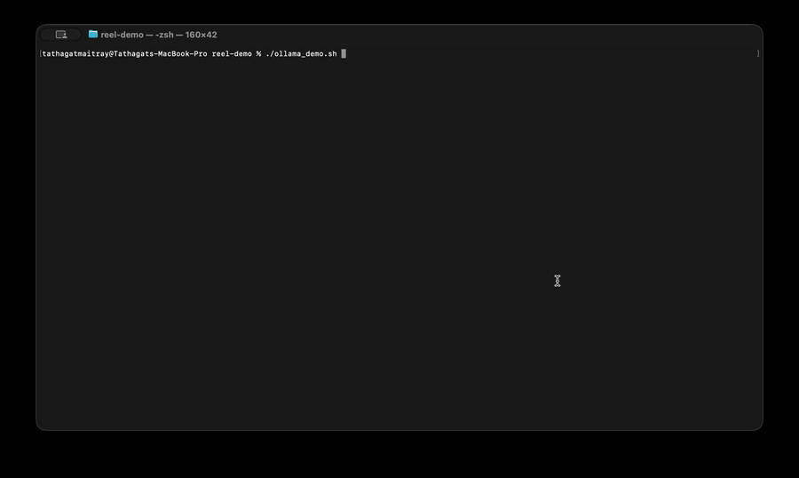

# Reel — VCR for LLM APIs

[](https://github.com/tathagat22/reel/actions/workflows/ci.yml)
[](https://tathagat22.github.io/reel/)
[](https://pypi.org/project/reel-vcr/)
[](LICENSE)
[](pyproject.toml)

Record OpenAI, Anthropic, and Gemini API calls once, then replay them in your tests, your CI, or your local dev loop — for free, forever. **No mocks. No SDK changes. No real network in CI. No surprise bills.**



```bash
pip install reel-vcr
reel auto -c tape.jsonl &
export OPENAI_BASE_URL=http://127.0.0.1:7878/v1
python your_app.py
# First call: forwarded to OpenAI, captured to tape.jsonl.
# Every call after: replayed from disk in ~3 ms. Zero spend.
```

Cassettes are plain JSONL — you `grep` them, `jq` them, `git diff` them in PRs. Secrets and PII are scrubbed at capture time, so they're safe to commit.

> **Docs**: <https://tathagat22.github.io/reel/> · **Issues**: <https://github.com/tathagat22/reel/issues>

---

## What Reel is

A local HTTP proxy that sits between your code and the LLM provider. On the first call to a given prompt, Reel forwards the request upstream and writes the wire-level request/response pair to a JSONL "cassette" file. On every subsequent call with the same fingerprint, the cassette serves the recorded response from disk — about 250× faster than the network and ~$0 to your billing.

It works with **any OpenAI-compatible endpoint** (OpenAI, Ollama, NVIDIA NIM, vLLM, Groq, Together, OpenRouter, LM Studio), Anthropic's `/v1/messages` API, and Google's Gemini `/v1beta/models/...:generateContent` API. Streaming is captured chunk-by-chunk with millisecond timing fidelity — replays reproduce the original TTFT and inter-chunk gaps within ~20 ms.

## Real scenarios that motivated this

### Your pytest suite bills you on every push

Tests that call `OpenAI().chat.completions.create(...)` cost real money on every CI run — maybe $0.10, maybe $5, multiplied by every PR push by every team member by every retry. Add Reel:

```python
# tests/test_summarize.py
def test_summarize(reel_cassette):           # fixture auto-registered by the pytest plugin
    from openai import OpenAI
    resp = OpenAI().chat.completions.create(
        model="gpt-5",
        messages=[{"role": "user", "content": "Summarize this..."}],
    )
    assert "TL;DR" in resp.choices[0].message.content
```

First run records to `tests/cassettes/test_summarize.jsonl`. Every run after replays from disk. In CI: `pytest --reel-mode replay` — any uncaptured request 404s, so the test suite cannot accidentally hit a real API. CI runs without an API key.

### A user reported a weird LLM answer; you can't reproduce it locally

In production you have logs but no way to replay the exact call. Hand the affected cassette to a developer on a separate machine — they replay your production traffic byte-for-byte, with no API key and no risk of mutating live data. Reel records the actual request body and the upstream's actual response, not a model card.

### You're iterating on a prompt; every tweak re-spends tokens

A prompt-engineering session hits the API dozens of times per evening. With Reel in `auto` mode, each unique prompt costs real money once; every variation you've already tried replays free. Combine with `reel diff -l old.jsonl -r new.jsonl` to see exactly what changed between two prompt versions.

### Your AI coding agent is slow

Aider, opencode, Claude Code, Cursor, Codex CLI — most coding agents send the same file content, the same chunk embeddings, the same tool definitions to the LLM many times during a session. Reel caches the deterministic parts so re-asking similar questions hits disk instead of the network. Verified to work transparently with Aider, opencode (NVIDIA NIM upstream), and Claude Code (via `ANTHROPIC_BASE_URL`).

## The pytest plugin

Auto-registered via the `pytest11` entry point. No `conftest.py` edits.

```python
# Fixture form — cassette path is inferred from the test name:
def test_chat(reel_cassette):
    OpenAI().chat.completions.create(...)

# Decorator form — custom cassette path:
from reel.sdk import cassette

@cassette("tests/cassettes/golden_chat.jsonl")
def test_chat_golden():
    OpenAI().chat.completions.create(...)

# Marker form — for pytest-marker fans:
import pytest

@pytest.mark.cassette("tests/cassettes/chat.jsonl", mode="record")
def test_chat_marker(reel_cassette):
    OpenAI().chat.completions.create(...)
```

`pytest --reel-mode replay` forces every cassette into replay mode regardless of what the test source code says — useful for CI where you want to fail loud on any uncaptured request.

Full walkthrough: [docs/guides/pytest.md](docs/guides/pytest.md).

## Provider support

Single proxy, three first-class providers, plus anything OpenAI-compatible:

| Provider | Endpoint Reel routes | Streaming |
|---|---|---|
| **OpenAI** | `/v1/chat/completions`, `/v1/embeddings`, `/v1/responses`, ... | ✅ SSE |
| **Anthropic** | `/v1/messages` | ✅ SSE with `event:` lines |
| **Google Gemini** | `/v1beta/models/<model>:generateContent`, `:streamGenerateContent` | ✅ SSE |
| **NVIDIA NIM** | OpenAI-compatible — `--upstream https://integrate.api.nvidia.com` | ✅ |
| **Ollama** | OpenAI-compatible at `http://localhost:11434/v1` | ✅ |
| **vLLM, LM Studio, Groq, Together, OpenRouter** | OpenAI-compatible — set `--upstream` to whatever they serve | ✅ |
| **Azure OpenAI, AWS Bedrock, GCP Vertex** | Proxied generically; first-class adapters on the roadmap | ✅ |

For multi-provider apps in a single session, use the explicit URL prefix: `http://127.0.0.1:7878/openai/v1/...`, `/anthropic/v1/...`, `/gemini/v1beta/...`. The same proxy handles all three at once.

## How Reel compares

| Tool | Where it sits | Works with non-Python? | SSE streaming? | Breaks when SDKs change transport? |
|---|---|---|---|---|
| **Reel** | HTTP proxy | Yes (any language) | ✅ with timing fidelity | No — it's language-agnostic |
| **VCR.py / pytest-recording / pytest-vcr** | Monkey-patches urllib3 / requests | No (Python only) | Partial | Yes — breaks on transport changes |
| **respx / pytest-httpx** | Mocks httpx at the client layer | Python only | Limited | Yes |
| **Hand-rolled mocks** | Inside your code | No | Whatever you implement | Whenever you forget to update them |
| **WireMock / MockServer** | HTTP proxy (Java) | Yes | Manual fixtures | Generic, not LLM-aware |

The trade-off: **VCR.py is easier to drop into a single test in a single file. Reel is easier to use across a whole project and any client that respects the standard `OPENAI_BASE_URL` / `ANTHROPIC_BASE_URL` env-var convention.**

Reel also ships the things you'd build yourself anyway: a smart matcher for prompts that drift slightly between runs (`exact / normalized / ignore-fields / fuzzy`), capture-time secret + PII scrubbing, a pre-commit hook that refuses to commit cassettes still containing detectable keys, and an analytics CLI for browsing, costing, and diffing recorded sessions.

## CLI commands

| Command | What it does |
|---|---|
| `reel auto -c <path>` | Replay if cached, else record (the dev-loop default) |
| `reel record -c <path>` | Always forward to upstream + capture |
| `reel replay -c <path>` | Cassette only; 404 on miss. **The CI mode.** |
| `reel ui -c <path>` | Local web inspector — browse and search cassettes in a browser |
| `reel inspect -c <path>` | Rich-table view with composable filters (provider, model, status, has-tool-call, regex) |
| `reel cost -c <path>` | Token totals × current OpenAI/Anthropic/Gemini pricing → $ summary |
| `reel diff -l A -r B` | Aligned diff of two cassettes — surface what regressed |
| `reel stats -c <path>` | Counts, error rate, token totals, TTFT distribution |
| `reel redact -c <path>` | Post-hoc scrub of secrets/PII from an existing cassette |
| `reel doctor` | Sanity check: ports, upstreams, write perms, optional dep state |
| `reel version` | Print installed version |

Run `reel <command> --help` for flags.

## Architecture

```
src/reel/
├── proxy/        HTTP + SSE core — forwarder, mode handlers, stream capture, structured logs
├── adapters/     ProviderAdapter interface — openai.py · anthropic.py · gemini.py
├── cassette/     Schema · writer · reader · matcher · body codec · in-memory store
├── redact/       Secret + PII pattern scrubbing
├── analytics/    Pure functions over CassetteEntry — filters · cost · diff · stats
├── inspector/    `reel ui` — Starlette + HTMX + Pico.css, no JavaScript build step
├── cli/          Typer commands wired into the `reel` console_script
└── sdk/          @cassette decorator + pytest plugin
```

Deeper dive: [docs/architecture.md](docs/architecture.md). Roadmap: [docs/roadmap.md](docs/roadmap.md).

## FAQ

### Is this just VCR.py with extra steps?

No. VCR.py and pytest-recording monkey-patch Python HTTP clients (`urllib3`, `requests`, `httpx`). When OpenAI or Anthropic ship a new SDK with a different transport, those tools silently break. Reel is an HTTP proxy — it sees the actual bytes on the wire, no matter what client sent them, no matter what language. It also works with non-Python clients (Cursor, Aider's Go bits, your TypeScript scripts).

### Will it work with my coding agent — Claude Code, Aider, opencode, Cursor?

- **Aider** — yes, transparently. Aider respects `OPENAI_API_BASE`.
- **opencode** — yes, transparently. Verified with the NVIDIA NIM upstream.
- **Claude Code** — yes; verified that the Claude Code binary respects `ANTHROPIC_BASE_URL`. Run `ANTHROPIC_BASE_URL=http://127.0.0.1:7878 claude ...`.
- **Cursor** — yes with a one-line config change. Cursor's settings expose a "Custom OpenAI Base URL" field.
- **Codex CLI** — yes, transparently. Uses the standard OpenAI env vars.
- **Continue.dev** — yes via the custom-endpoint configuration.

A `reel run -- <command>` zero-config wrapper is on the roadmap for the next minor release.

### What about non-deterministic LLM responses?

The cassette stores the actual response the upstream returned on the first call. On replay, that exact response is served back. **Determinism is at the cassette level, not at the LLM level — that's the point.** If you genuinely need the model to think fresh every test run, don't put that test under Reel. For the in-between case (same prompt, different context window injected by your code), Reel's `ignore-fields` matcher mode lets you drop the parts you don't want fingerprinted.

### Does it handle SSE streaming?

Yes, and that's the hardest thing Reel does. Each SSE chunk is captured with its wall-clock offset from the first byte. On replay, chunks are emitted with `asyncio.sleep` based on those offsets, so timing-sensitive client code (live token-by-token UIs, latency assertions) behaves the same way against a cassette as it does against the real upstream. Three timing modes: `--timing realtime | fast | slow=<N>`.

### What about API keys in cassettes?

Reel **never** captures request headers — that's where API keys live in every supported provider. The cassette only stores method, path, body, and the fingerprint. Response bodies are also scanned for embedded keys (sk-*, sk-ant-*, AIza*, ghp_*, AKIA*, etc.) and Bearer tokens, with detected matches replaced by a redaction marker before the entry hits disk. A bundled pre-commit hook (`hooks/pre-commit-cassette-check.py`) refuses to commit any cassette that still contains a detectable secret pattern.

### Does it work with local models? Ollama, vLLM, LM Studio?

Yes. Anything serving an OpenAI-compatible `/v1/chat/completions` endpoint works as an upstream. For Ollama:

```bash
reel auto -c tape.jsonl --upstream http://localhost:11434
```

Then any OpenAI SDK pointed at Reel routes through Ollama. The benefit even with local models: replay is ~3 ms while inference is 200-2000 ms, so iterating on prompts gets dramatically faster.

### Why is the PyPI package named `reel-vcr` but I `import reel`?

The bare `reel` name on PyPI was already registered by an unrelated async-subprocess library. Rather than rename the whole project, Reel follows the same convention as Pillow (`pip install pillow` → `import PIL`) and scikit-learn (`pip install scikit-learn` → `import sklearn`). The PyPI distribution name is `reel-vcr`; the CLI binary, GitHub repo, and Python import path are all just `reel`.

### Can I use this with tool calls / function calling?

Yes. Tool definitions are part of the request body and participate in the fingerprint, so a request with different `tools` content gets a different cassette key. The `tool_calls` field in responses is captured and replayed normally. The case Reel doesn't yet handle elegantly is multi-turn agentic loops where the LLM picks a tool, your code runs it, and the loop continues for many rounds — each individual call works, but order-of-operations matching across long loops is a roadmap item.

### Is there a hosted version? Reel Cloud?

No, and there isn't a plan to build one until there's clear pull for it. Reel runs entirely on `127.0.0.1`, writes only to files you explicitly point it at, ships no telemetry, and makes no network calls of its own besides forwarding requests to whatever upstream you configured.

### Does it work in CI — GitHub Actions, GitLab, CircleCI?

Yes. The recommended CI pattern is:

```yaml
- run: pip install reel-vcr
- run: pytest --reel-mode replay
```

Replay mode fails loud on any uncaptured request, so you can't accidentally hit a real API from CI even if a teammate forgot to commit a cassette. See [docs/guides/ci.md](docs/guides/ci.md).

### How do I uninstall?

```bash
pip uninstall reel-vcr
```

That's it. No daemon survives, no shell config edits, no `~/.config` directories created. The only state Reel writes is the cassette files you explicitly named.

## Status

**v0.1.0 is live on PyPI.** Verified clean install on Python 3.11, 3.13, and 3.14 (102 install/import/runtime checks). 344 tests in the project's own suite, green on every CI run. Apache 2.0. Issues and PRs welcome — see [CONTRIBUTING.md](CONTRIBUTING.md).

## Install

```bash
pip install reel-vcr           # CLI binary + import path stay `reel`
reel --help
```

Or from source:

```bash
git clone https://github.com/tathagat22/reel && cd reel
uv sync
uv run reel --help
```

## Development

```bash
uv sync
make check         # ruff + ruff format + pyright (strict) + pytest — must pass before every commit
uv run reel auto -c ./scratch/test.jsonl
```

CI runs lint, format check, type check (pyright strict), and the full test suite on Python 3.11 / 3.12 / 3.13 — see [.github/workflows/ci.yml](.github/workflows/ci.yml). The mkdocs-material docs site auto-deploys to GitHub Pages on every push to `main` — see [.github/workflows/docs.yml](.github/workflows/docs.yml).

## License

[Apache 2.0](LICENSE) — use, fork, vendor, embed, ship.

---

<sub>Tags: VCR for LLM APIs · OpenAI API testing · Anthropic API mock · Gemini API testing · pytest OpenAI plugin · VCR.py alternative · pytest-recording alternative · pytest-vcr alternative · respx alternative · free LLM API testing · offline LLM testing · deterministic LLM tests · LLM cost reduction in CI · record replay LLM API · SSE streaming mock · Ollama proxy · NVIDIA NIM proxy · Aider proxy · Claude Code cache · Cursor cache · opencode cache · llm cassette · OpenAI mock testing · Anthropic mock · python LLM testing</sub>
